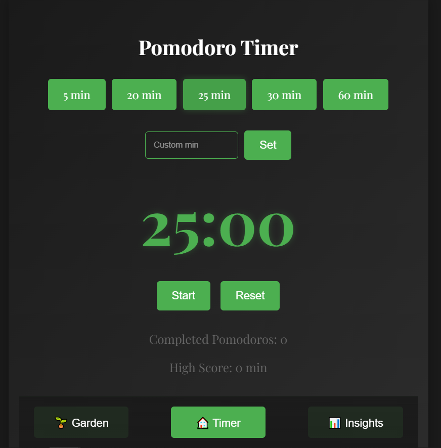
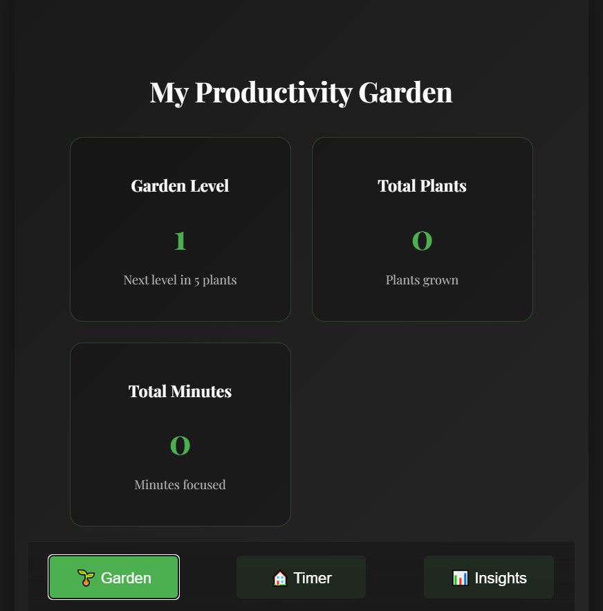
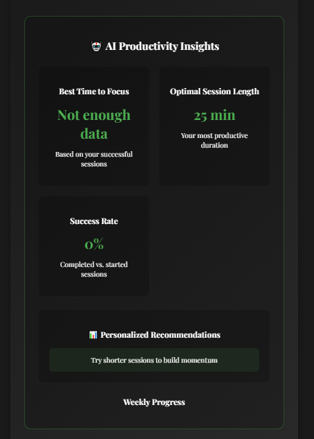

# 🍅 Pomodoro Garden: A Productive Timer with Growth


## 🌱 Overview

Pomodoro Garden is not just another timer - it's a productivity companion that grows with you! Watch your focus sessions bloom into a beautiful virtual garden while gaining insights into your productivity patterns.

  
  
  

## ✨ Features

- 🕒 Customizable Pomodoro timer (5, 20, 25, 30, 60 minutes)
- 🌿 Visual garden that grows with completed sessions
- 📊 AI-powered productivity insights
- 🎯 Progress tracking and achievements
- 🎨 Clean, minimalist dark theme interface
- 📱 Fully responsive design

## 🚀 Live Demo

[Check out Pomodoro Garden in action!]([https://your-demo-link.com](https://pomodoro-timer-eu6w.onrender.com/))

## 🛠️ Technologies Used

- React 18.2.0
- CSS3 with Flexbox/Grid
- Local Storage for data persistence
- Chart.js for data visualization

## 📦 Installation

1. **Clone the repository:**

   ```bash
   (https://github.com/apih00/pomodoro-garden.git)
   ```

2. **Navigate to the project directory:** (Recommended)

   ```bash
   cd pomodoro-garden
   ```

3. **Install dependencies:**

   ```bash
   npm install
   ```

4. **Start the development server:**

   ```bash
   npm start 
   ```


## 💻 Usage

1. **Timer**: Select a duration or set a custom time
2. **Garden**: Watch your garden grow with each completed session
3. **Insights**: View your productivity patterns and recommendations

## 🌟 Key Components

### Timer Page 🕒
- Customizable duration settings
- Visual and audio notifications
- Session tracking

### Garden View 🌺
- Visual representation of productivity
- Achievement system
- Progress tracking

### Insights Dashboard 📈
- Productivity patterns analysis
- AI-powered recommendations
- Success rate tracking

## 📱 Screenshots

[Add your screenshots here]

## 🤝 Contributing

Contributions are welcome! Please feel free to submit a Pull Request. For major changes, please open an issue first to discuss what you would like to change.

1. Fork the Project
2. Create your Feature Branch (`git checkout -b feature/AmazingFeature`)
3. Commit your Changes (`git commit -m 'Add some AmazingFeature'`)
4. Push to the Branch (`git push origin feature/AmazingFeature`)
5. Open a Pull Request

## 📝 License

This project is licensed under the MIT License - see the [LICENSE](LICENSE) file for details.

## 🙏 Acknowledgments

- Inspired by the Pomodoro Technique by Francesco Cirillo
- Plant emoji designs by [Source]
- Sound effects from [Source]

## 📬 Contact

Your Name - [https://twitter.com/apihnine9]

Project Link: [https://github.com/yourusername/pomodoro-garden](https://github.com/apih99/pomodoro-garden)

## 🔮 Future Features

- 🌍 Multi-language support
- 🎵 Custom focus music integration
- 👥 Social features and shared gardens
- 📱 Progressive Web App (PWA) support
- 🔄 Data sync across devices

---

<p align="center">Made with 💚 and lots of ☕</p>
